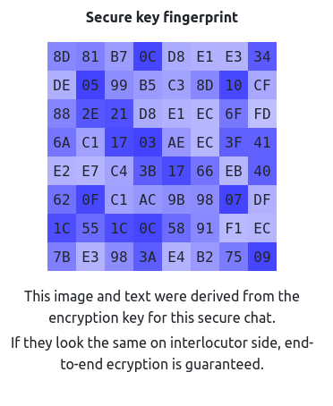
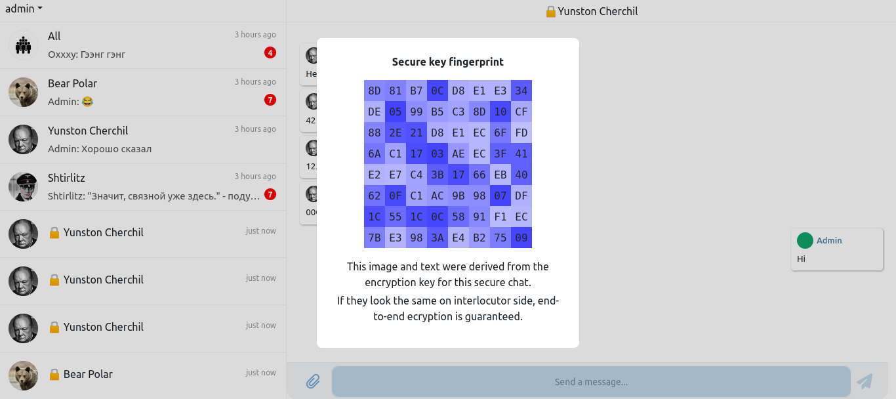
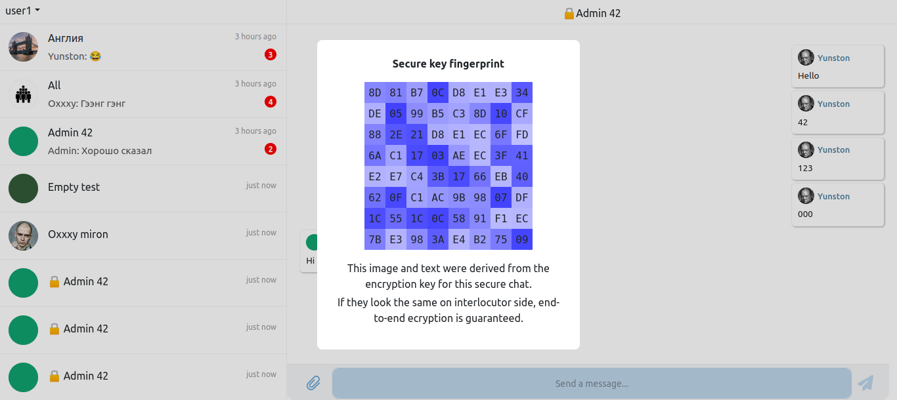

# Implementation note

* [Авторизация](#авторизация)
* [Личные и груповые чаты](#личные-и-груповые-чаты)
* [Секретные чаты](#секретные-чаты)
* [Криптографические алгоритмы](#реализация)
* [Реализация секретных чатов](#реализация-секретных-чатов)
* [Защита от MITM (Отпечаток)](#fingerprint)

# Авторизация

### Регистрация пользователя

При регистрации пользователь указывает свои данные:
* Имя
* Фамилия
* Уникальный логин пользователя
* Пароль

Клиентское приложение посылает запрос на сервер: (путь `/api/v1/auth/register`)

В ответ получает jwt токен (Подробнее описанно далее)

### Вход пользователя

При входе пользователь указывает свои данные:
* Уникальный логин пользователя
* Пароль

Клиентское приложение посылает запрос на сервер: 

[ChatApi.ts:66](https://github.com/MrDoctorASAP/e2ee/blob/main/frontend/src/api/ChatApi.ts#L66)
```ts
export async function login(userCredentials: IUserCredentials): Promise<IAuth|null> {
  return await post('/api/v1/auth/login', userCredentials)
}
```

В ответе сервера содержится следующая информация:
```json
{
  "userId": 1,
  "username": "admin",
  "token": "..."
}
```

* `userId` - идентификатор пользователя
* `username` - логин пользователя
* `token` - специальный jwt токен

После успешной авторизации эта информация сохраняется в локальное хранилище и переиспользуется:

[SecureChatStorage.ts:8](https://github.com/MrDoctorASAP/e2ee/blob/main/frontend/src/model/SecureChatStorage.ts#L8)

```ts
export function storeAuth(auth: IAuth) {
  if (!auth) return
  localStorage.setItem('AUTH', JSON.stringify(auth))
}
```

При следующем входе на страницу она будет загруженна:

[SecureChatStorage.ts:14](https://github.com/MrDoctorASAP/e2ee/blob/main/frontend/src/model/SecureChatStorage.ts#L14)

```ts
export function loadAuth() {
  const auth = localStorage.getItem('AUTH')
  if (!auth) return null
  return JSON.parse(auth)
}
```

### Авторизованные запросы

При запросах к серверу требующих авторизации в запрос включается `token`.
По этому токену сервер сможет идентифицировать пользователя и проверить подлинность запроса

Токен включается в заголовок запроса в следующем формате:

```
authorization: Bearer [token]
```

Пример кода:
[ChatApi.ts:25](https://github.com/MrDoctorASAP/e2ee/blob/main/frontend/src/api/ChatApi.ts#L25)
```js
fetch(url, {
  headers: {
    'authorization': 'Bearer ' + token
  }
})

```

Страница логина - [LoginPage.jsx](https://github.com/MrDoctorASAP/e2ee/blob/main/frontend/src/ref/components/LoginPage.jsx)

### Jwt token
Jwt token - стандарт авторизации
https://ru.wikipedia.org/wiki/JSON_Web_Token

# Личные и груповые чаты

При отпралении сообщений в **персональные** и **груповые** чаты, серверу передаётся информация:
* Идентификатор чата
* Текст сообщения

Сообщения шифруются при передаче между клиентом и сервером по протоколу HTTPS, когда сообщения пришли на сервер, теоритически они могут быть прочитаны.
На деле сервер не читает сообщения, а только перенаправляет их в базу данных, в которой они хранятся в зашифрованном виде.

# Секретные чаты

Секретные чаты имеют ряд значительных отличий:

Сообщения не хранятся на сервере. Постоянный доступ к расшифрованным сообщениям имеют только учатники секретного чата.

Сообщения на сервере сохраняются, только в одном случае: когда получатель не в сети.
В таком случае сообщения будут сохранены до момента их получения клиентом, после чего будут удалены. Однако сервер не может прочитать содержимое сообщений, по скольку не имеет ключа шифрования.

При передаче сообщений на сервер используется [сквозное шифрование](https://ru.wikipedia.org/wiki/%D0%A1%D0%BA%D0%B2%D0%BE%D0%B7%D0%BD%D0%BE%D0%B5_%D1%88%D0%B8%D1%84%D1%80%D0%BE%D0%B2%D0%B0%D0%BD%D0%B8%D0%B5).

Сквозное шифрование - метод обмена информацией, при котором только участники общения имеют доступ к сообщениям.
В основе сквозного шифрования лежит идея, что ключи шифрования известны только общающимся между собой сторонам.

В основе реадизации данного метода лежит симметричное шифрование сообщений общим ключём. При передаче сообщения отправитель шифрует сообщение своим ключём, а получатель расшифровает. Таким образом третья сторона не имеет доступа к информации.

Для данного подхода, необходимо получить этот общий симметричный ключ таким образом, что бы он был только у получателя и отправителя.

Для реализации обмена ключей был выбран [протокол Диффи — Хеллмана на эллиптических кривых](https://ru.wikipedia.org/wiki/%D0%9F%D1%80%D0%BE%D1%82%D0%BE%D0%BA%D0%BE%D0%BB_%D0%94%D0%B8%D1%84%D1%84%D0%B8_%E2%80%94_%D0%A5%D0%B5%D0%BB%D0%BB%D0%BC%D0%B0%D0%BD%D0%B0_%D0%BD%D0%B0_%D1%8D%D0%BB%D0%BB%D0%B8%D0%BF%D1%82%D0%B8%D1%87%D0%B5%D1%81%D0%BA%D0%B8%D1%85_%D0%BA%D1%80%D0%B8%D0%B2%D1%8B%D1%85)

Этот протокол имеет стандартизированную реализацию и доступен по средствам Web API [SubtleCrypto](https://developer.mozilla.org/en-US/docs/Web/API/SubtleCrypto/deriveKey#ecdh).

Полная схема обмена ключами описанна в файле [KeyExchange2.pdf](https://github.com/MrDoctorASAP/e2ee/blob/main/doc/KeyExchange2.pdf)

После обмена только отправитель и получатель имеют общий секретный ключ, который будет использован для шифрования сообщений.

Сообщения шифруются по алгоритму [AES-GCM](https://developer.mozilla.org/en-US/docs/Web/API/SubtleCrypto/encrypt#aes-gcm)

Одно из основных отличий этого режима от других заключается в том, что GCM является режимом с «аутентификацией», что означает, что он включает проверки того, что зашифрованный текст не был изменен злоумышленником.

Полная схема передачи сообщений описанна в файле [SecureMessage.pdf](https://github.com/MrDoctorASAP/e2ee/blob/main/doc/SecureMessage.pdf)

На сервер передаётся:
* Идентификатор секретного чата
* Зашифрованное сообщение
* Вектор иницилизации (IV) - Нужен для AES; Является публичной информацией.

# Реализация

### Base64

Поскольку все криптографические алгоритмы работают с массивами байт, 
а для передачи на сервер по HTTP необходимо использовать текст, 
информация переводится из байтового представления в текстовый с помошью алгоритма BASE64.

[Encryption.ts:7](https://github.com/MrDoctorASAP/e2ee/blob/main/frontend/src/model/Encryption.ts#L7)

```ts
// Преобразовывает массив байт в текст
export function toBase64(buffer: ArrayBuffer) {
  return btoa(String.fromCharCode(...new Uint8Array(buffer)))
}
```

[Encryption.ts:11](https://github.com/MrDoctorASAP/e2ee/blob/main/frontend/src/model/Encryption.ts#L11)

```ts
// Преобразовывает текст в массив байт
export function fromBase64(base64: string) {
  return Uint8Array.from(atob(base64), c => c.charCodeAt(0))
}
```

Эта группа преобразований является однозначно обратимой, то есть:

```ts
toBase64(fromBase64(text)) === text
fromBase64(toBase64(bytes)) === bytes
```

### Генерация пары открытый/закрытый ключ

[Encryption.ts:25](https://github.com/MrDoctorASAP/e2ee/blob/main/frontend/src/model/Encryption.ts#L25)

```ts
/**
 * Создаёт пару открытый/закрытый ключ для создания общего симмитричного ключа
 * по протоколу Диффи — Хеллмана на эллиптических кривых.
 * Каждый вызов метода возвращает уникальную пару.
 * 
 * ECDH (Elliptic Curve Diffie-Hellman) — это алгоритм согласования ключей.
 * Это позволяет двум людям, у каждого из которых есть пара открытого и закрытого ключей ECDH,
 * сгенерировать общий секрет: то есть секрет, которым они — и никто другой — не делятся.
 * Затем они могут использовать этот общий секрет в качестве симметричного ключа для защиты своей связи.
 */
export async function generateKeyPair() : Promise<CryptoKeyPair> {
  return window.crypto.subtle.generateKey(
    {
      name: "ECDH", // Протокол Диффи — Хеллмана на эллиптических кривых
      namedCurve: "P-384", // Вид кривой для генерации ключей
    },
    true, // Ключ может быть экспортирован
    ["deriveKey"] // Назначение ключа - deriveKey (создание общего симметричного ключа)
  );
}
```

### Экспорт и импорт ключей

[CryptoKey](https://developer.mozilla.org/en-US/docs/Web/API/CryptoKey) и [CryptoKeyPair](https://developer.mozilla.org/ru/docs/Web/API/CryptoKeyPair) - являются обьектами ключей. 
Ключи хранятся в некотором специальном виде и для получения их значения используются методы [export](https://developer.mozilla.org/en-US/docs/Web/API/SubtleCrypto/exportKey) и [import](https://developer.mozilla.org/en-US/docs/Web/API/SubtleCrypto/importKey)

* Export - преобразование CryptoKey к виду подходящему для передачи и хранения.
* Import - преобразование экпротированного ключа к виду подходящему для использования в методах шифрования (CryptoKey)

Экпортироваит можно только те ключи которые имеют свойство `extractable: true`

Для экпорта ключей используются два предстваления: 
* `raw` - массив байт
* `jwk` - обьект содержащий значение ключа и метаинформацию

`raw` используется для экпорта и импорта открытых ключей

[Encryption.ts:60](https://github.com/MrDoctorASAP/e2ee/blob/main/frontend/src/model/Encryption.ts#L60)

```ts
// Экпорт открытого ключа в текстовый вид для передачи на сервер
export async function exportPublicKey(key: CryptoKey): Promise<string> {
  // Преобразование ключа в массив байт
  const raw = await window.crypto.subtle.exportKey('raw', key)
  // Преобразование массива байт в base64 текст
  return toBase64(raw)
}
```

Пример экпортированного публичного ключа, в таком виде он будет оправлен на сервер:

```
BIvzo8fOoOKRJ/RYg/8Jfs+Bi2GT4FKygfXYYSfq78rOYH9V8xcIOA3Lv6gRPyvUjAoAx6OYV+TcDZEAoIYssilVQlq01lLCn/yMUrUoo3f458nAfipewh6VZJ2ZA3NxD4U4xg== 
```

**Импорт публичного ключа**

[Encryption.ts:65](https://github.com/MrDoctorASAP/e2ee/blob/main/frontend/src/model/Encryption.ts#L65)

```ts
export async function importPublicKey(raw: string): Promise<CryptoKey> {
  // Преобразование массива текста в массив байт
  const data = fromBase64(raw)
  // Преобразование массива байт в ключ
  return await window.crypto.subtle.importKey('raw', data,
    {
      name: "ECDH", // Для какого алгоритма будет использован ключ
      namedCurve: "P-384", // Дополнительная информация о алгоритме - название эллиптической кривой
    },
    true, // Может ли ключ быть экспортирован
    ["deriveKey"] // Назначение ключа - генерация общего секретно ключа
  )
}
```

**Экспорт приватного ключа**

Приватный ключ должен быть экпортирован для хранения на клиенте (на сервер он передаватся не будет)

```ts
export async function exportPrivateKey(key: CryptoKey): Promise<string> {
  // Преобразование ключа в объект, содержащий значение ключа и метаинформацию
  const jwk = await window.crypto.subtle.exportKey('jwk', key)
  // Преобразование объекта в json
  return JSON.stringify(jwk)
}
```

Пример экпортированного ключа:

```json
{
  "crv":"P-384",
  "d":"XxrgNoIklMznulWWBQgDkMbvqtjsCIj89ADRwLaC54lmMx3m2B23fRCmeUIxhd",
  "ext":true,
  "key_ops":["deriveKey"],
  "kty":"EC",
  "x":"LBlaEgLHB3R-NufY_xtiGZ3IMvWR-AT9nQJzWuolpxygfxCJDZzBgi0im5GtN2p7","y":"AxRwIso3TLy_lAJBG0JCEPxDKYCb0DkQpvYRFjrBVCVrOHLGIoMuTbkmzb1P-WLujd"
}
```

**Импорт приватного ключа**

```ts

export async function importPrivateKey(raw: string): Promise<CryptoKey> {
  // Преобразование из json в обьект
  const jwk = JSON.parse(raw)
  // Преобразование обьекта в ключ
  return await window.crypto.subtle.importKey('jwk', jwk,
    {
      name: "ECDH",
      namedCurve: "P-384",
    },
    true,
    ["deriveKey"]
  )
}


```

**Экспорт и импорт секретного ключа**

Аналогично приватному, отличие лишь в указанном алгоритме и назначении ключа

```ts
export async function exportSecretKey(key: CryptoKey): Promise<string> {
  const jwk = await window.crypto.subtle.exportKey('jwk', key)
  return JSON.stringify(jwk)
}

export async function importSecretKey(raw: string): Promise<CryptoKey> {
  const jwk = JSON.parse(raw)
  return await window.crypto.subtle.importKey('jwk', jwk,
    {
      name: "AES-GCM", // Ключ будет использован для AES
      length: 256, // Длинна ключа
    },
    true,
    ["encrypt", "decrypt"] // Назначение ключа для шифрования и дешифрования
  )
}

```

### Получение общего секретного ключа

За получение общего ключа отвечет метод [deriveKey](https://developer.mozilla.org/en-US/docs/Web/API/SubtleCrypto/deriveKey)

После обмена ключей каждый из собеседников имеет свою пару ключей открытый/закрытый и открытый ключ собеседника.
Для создания общего ключа используется собственный приватный ключ и открытый ключ собеседника.

```ts

/**
 * Вычисляет общий симметричный ключ, одинаковый для собеседников,
 * для шифрования по алгоритму AES-GCM.
 * @param privateKey Закрытый ключ пользователя
 * @param publicKey Открытый ключ собеседника
 * @returns Общий симметричный ключ 
 */
export async function deriveSecretKey(privateKey: CryptoKey, publicKey: CryptoKey): Promise<CryptoKey> {
  return window.crypto.subtle.deriveKey(
    {
      name: "ECDH", // Проткол обмена ключей
      public: publicKey, // Публичный ключ собеседника
    },
    privateKey, // Свой приватный ключ
    {
      name: "AES-GCM", // Назначение секретного ключа
      length: 256, // Длинна ключа
    },
    true, // Может быть экпортирован
    ["encrypt", "decrypt"] // назначение
  );
}
```

После создания общего ключа он может быть использован для шифрования:

```ts

export interface IEncryptedMessage {
  message: string,
  iv: string
}

export async function encrypt(key: CryptoKey, message: string): Promise<IEncryptedMessage> {
  // Создание случайного вектора иницилизации 
  const iv = window.crypto.getRandomValues(new Int8Array(12))
  // Преобразование текта сообщения в массив байт через TextEncoder
  const encoder = new TextEncoder()
  const encodedText = encoder.encode(message);
  // Шифрование массива байт
  const encrypted = await window.crypto.subtle.encrypt(
    { name: "AES-GCM", iv: iv },
    key,
    encodedText
  );
  // преобразование массива байт в тектовый вид через base64
  return {message: toBase64(encrypted), iv: toBase64(iv)}
}

```

**Дешифрование сообщения**

```ts
export async function decrypt(key: CryptoKey, message: IEncryptedMessage): Promise<string> {
  const decoder = new TextDecoder()
  const decrypted = await window.crypto.subtle.decrypt(
    { name: "AES-GCM", iv: fromBase64(message.iv) }, key, fromBase64(message.message)
  );
  return decoder.decode(decrypted)
}
```

# Реализация секретных чатов

## Создание секретного чата (Алиса)

```ts

// Создание секретного чата с пользователем recipient
const onCreateSecureChat = async (recipient) => {
  
  // Создание пары открытый/закрытый ключ
  const keys = await generateKeyPair()
  
  // Экпорт публичного ключа
  const publicKey = await exportPublicKey(keys.publicKey)
  
  // Запрос на сервер, в ответ получение уникального идентификатора чата
  const secureChatId = await API.createSecureChat(auth, { publicKey, recipient.userId })

  // Сохранение публичного и приватого ключа в локальное хранилище
  await storePublicKey(secureChatId, keys.publicKey)
  await storePrivateKey(secureChatId, keys.privateKey)

  // Сохранение ифнормации о чате в локальное хранилище
  const secureChat = storeSecureChat(secureChatId, recipient)

  // Добавление чата в список
  chatList.registerChat(secureChat)

}
```

### Получение запроса на создание секретного чата (Боб)

```ts

// Получение приглащения в секретный чат
const onInvite = async (invite) => {

  // Импорт публичного ключа отправителя полученного из приглашения
  const senderPublicKey = await importPublicKey(invite.publicKey)

  // Создание пары открытый/закрытый ключ
  const keys = await generateKeyPair()

  // Создание общего секретного ключа
  const secret = await deriveSecretKey(keys.privateKey, senderPublicKey)

  // Сохранение секретного ключа в локальное хранилище
  await storeSecretKey(invite.secureChatId, secret)

  // Сохранение ифнормации о чате в локальное хранилище
  const secureChat = storeSecureChat(invite.secureChatId, recipient)

  // Добавление чата в список
  chatList.registerChat(secureChat)
  
  // Запрос на сервер с подтверждением создания чата и передачей открытого ключа
  await API.accept({ 
    secureChatId: invite.secureChatId, 
    publicKey: await exportPublicKey(keys.publicKey) 
  })
}

```

### Звершение обмена ключей (Алиса)

```ts
const onExchange = async (exchange) => {
  
  // Загрузить открытый/закрытый ключ из локального хранилища
  const privateKey = await loadPrivateKey(exchange.secureChatId)
  const publicKey = await loadPrivateKey(exchange.secureChatId)
  
  // Экпортировать открытый ключ собеседника полученный в ответе на приглашение
  const recipientPublicKey = await importPublicKey(exchange.publicKey)
  
  // Создание общего секретного ключа
  const secret = await deriveSecretKey(privateKey, recipientPublicKey)

  // Сохранение секретного ключа в локальное хранилище
  await storeSecretKey(exchange.secureChatId, secret)

  // Послать запрос на сервер для подтверждения создания секретного чата
  await API.complete(auth, { exchange.secureChatId })

  // Удалить из локального хранилища открытый/закрытый ключ (Больше они не понадобятся)
  await clearTemporaryKeys(recipientKey.chatId)

}
```

### Отправка сообщения в секретный чат

```ts
const onSendMessage = async (secureChatId, message) => {
  
  // Загрузка секретного ключа из локального хранилища
  const secret = await loadSecretKey(secureChatId)
  
  // Шифрование сообщения
  const ecryptedMessage = await encrypt(secret, message)
  
  // Отправка зашифрованного сообщения на сервер
  await API.sendSecureMessage(auth, {secureChatId, ecryptedMessage})
  
  // Добавление сообщения в чат
  chatCache.addMessageToChat(secureChatId, message)
  
  // Сохранение сообщения в локальное хранилище
  storeSecureChatMessage(secureChatId, message)

}
```

### Получение сообщения

```ts

const onReciveMessage = async (secureChatId, message) => {

  // Загрузка секретного ключа из локального хранилища
  const secret = await loadSecretKey(secureChatId)

  // Дешифрование сообщения
  const decryptedMessage = await decrypt(secret, message)

  // Добавление сообщения в чат
  chatCache.addMessageToChat(secureChatId, decryptedMessage)

  // Сохранение сообщения в локальное хранилище
  storeSecureChatMessage(secureChatId, decryptedMessage)

  // Подтверждение получения сообщения
  await API.seenSecureChatMessage(auth, message.id)
}

```

# Fingerprint

Краткая теория:

Протокол Диффи-Хеллмана на эллиптических кривых (ECDH) подвержен [атаке MITM](https://ru.wikipedia.org/wiki/%D0%90%D1%82%D0%B0%D0%BA%D0%B0_%D0%BF%D0%BE%D1%81%D1%80%D0%B5%D0%B4%D0%BD%D0%B8%D0%BA%D0%B0).

При этой атаке злоумышленник может внедрится в канал связи пользователей и модифицировать трафик.

Например, при пердаче ключа между пользователями, ключ шифрования может быть скомпрометирован, тем самым дальнейшее общение будет небезопастным.

При атаке MITM на ECDH есть два вектора атаки:
* Подмена публичного ключа отправителя.
* Подмена публичного ключа получателя.

В обоих случаях злоумышленник получает полный доступ к сообщениям.

[Пример подобной атаки](https://ru.wikipedia.org/wiki/%D0%90%D1%82%D0%B0%D0%BA%D0%B0_%D0%BF%D0%BE%D1%81%D1%80%D0%B5%D0%B4%D0%BD%D0%B8%D0%BA%D0%B0#%D0%90%D1%82%D0%B0%D0%BA%D0%B0_%D0%BD%D0%B0_%D0%BF%D1%80%D0%BE%D1%82%D0%BE%D0%BA%D0%BE%D0%BB_%D0%94%D0%B8%D1%84%D1%84%D0%B8-%D0%A5%D0%B5%D0%BB%D0%BB%D0%BC%D0%B0%D0%BD%D0%B0)

## Защита от MITM атаки

Для предотващения MITM атак может быть использован ещё один канал связи для проверки ключей. Иными словами нам необходимо убедится, что тот ключ, который был отправлен пользователю, не был изменён при передаче.

Приведенный далее алгоритм не гарантирует полную безопастность, однако в значительной мере усложняет производимую атаку, тем самым делает обмен более надёжным.

#### Концепция

При обмене ключей мы будем сохранять данные, которые отправляем собеседнику.
Из этих данных мы сформирует некоторый **отпечаток** (Fingerprint).

Когда обмен будет произведён, мы можем сравнить отпечатки на каждой из сторон, тем самым убедится, что данные не были модифицированны при передаче.

#### Реализация

Отпечаток будет соостоять из:
* Открытого ключа создателя чата (который будет отправлен получателю)
* Общего секретного ключа (который будет создан из публичного ключа получателя)

Поскльку предполагается предача отпечатков (для сравнения), не могут быть использованы "чистые" значения ключей, их нужно "замаскировать":

Для "маскировки" будем использовать хэширование по алгоритму [SHA256](https://ru.wikipedia.org/wiki/SHA-2)

```ts
export async function sha256(data: Uint8Array) : Promise<Uint8Array> {
  // Хэширование
  const hash = await window.crypto.subtle.digest('SHA-256', data)
  // Приведение значения к Uint8Array, для более удобной работы
  return new Uint8Array(hash)
}
```

Создание отпечатка (производится на этапе создания общего секретного ключа):

```ts

// Вычисление отпечатка
export async function calculateFingerprint(secretKey: CryptoKey, publicKey: CryptoKey) {
  // Получение значений публичного и секретного ключей
  const secretRaw = new Uint8Array(await window.crypto.subtle.exportKey('raw', secretKey))
  const publicRaw = new Uint8Array(await window.crypto.subtle.exportKey('raw', publicKey))
  // Хэширование ключей
  const secretHash = await sha256(secretRaw)
  const publicHash = await sha256(publicRaw)
  // Формирование суммарного отпечатка как последовательноть двух хэшей
  return new Uint8Array([...publicHash, ...secretHash])
}

```

Отпечаток представляет собой 64 байта:
* Первый 32 байта - это SHA256 хэш публичного ключа создателя чата
* Последние 32 байта - это SHA256 хэш общего секретного ключа

SHA256 алгоритм всегда выдаёт 32 байта на выходе


### Визуализаци и обмен

Оптечатки созданы для сравнения их учатникми диалога.

Отпечатки будут визуализированны для более удобного сравнения.
Если они совпадают на обоих устройствах - шифрование надёжно.



8 на 8 ячеек: каждая ячейка это 1 байт, всего 64 байта.

Внутри ячейки значение байта в 16-ричной системе счисления.

Цвет ячейки для каждого байта определяется как:

```ts
// Текущий вариант (Может быть изменено позже):

// Компоненты цвета в модели HSL
const hue = fingerprint[0] ^ fingerprint[32]
const saturation = 75
const lightness = Math.floor(byte/51) * 8 + 40
// Цвет
const color = hsl(hue, saturation, lightness)
```


Канал и способ передачи мы оставим на выбор пользователей. Тем самым не давая возможности сформировать общий вектор атаки. 

Пример сравнения отпечатков для admin и user1:

**Admin**



**User 1**


